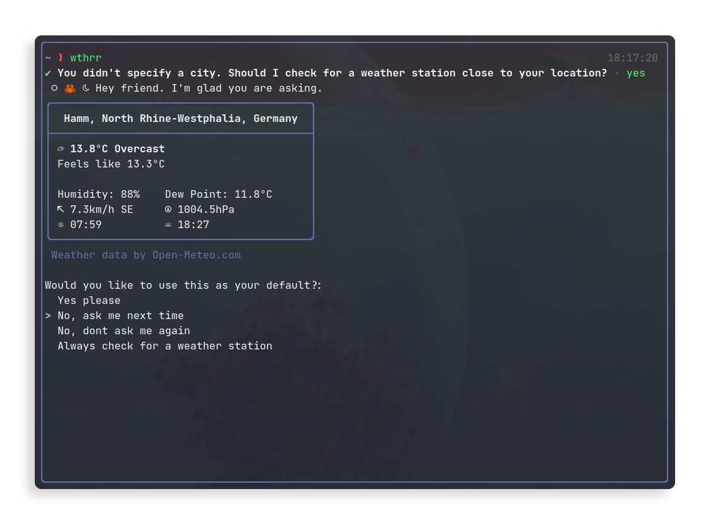
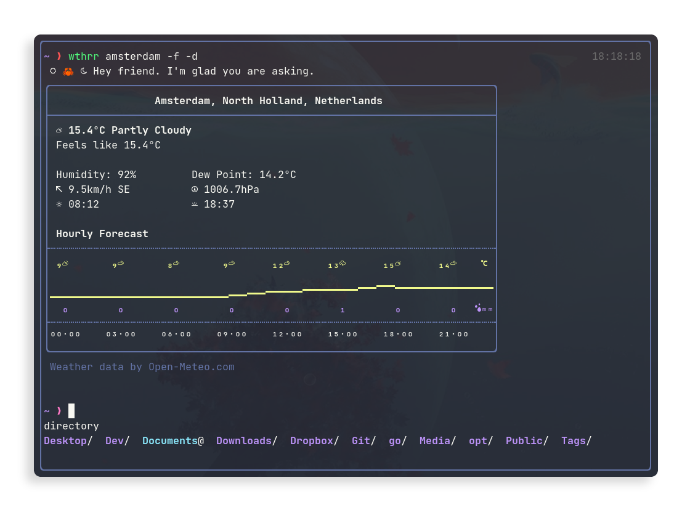
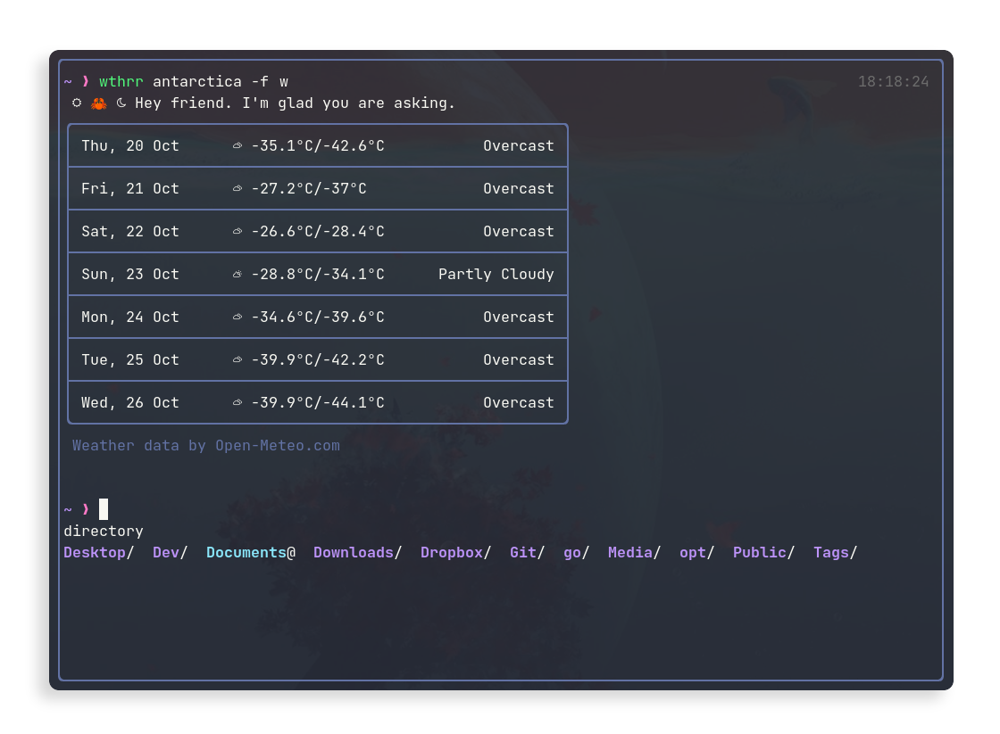
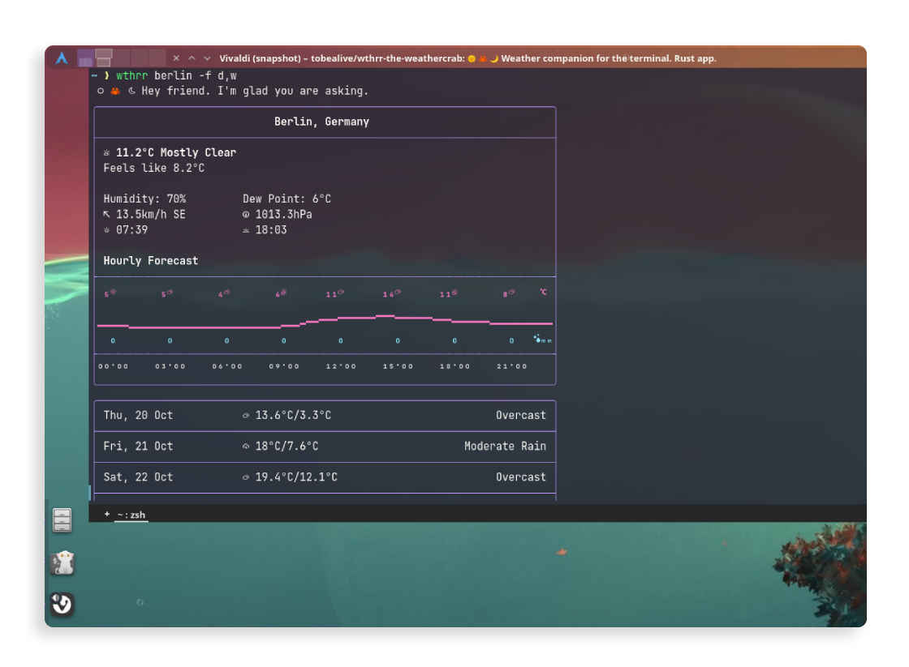

# 🦀 wthrr-the-weathercrab

`wthrr` lives in your terminal and her passion is meteorology.

If you spend time in the TUI, you'll have a little companion nearby who knows about the weather.

## Contents

- [How to use?](https://github.com/tobealive/wthrr-the-weathercrab#how-to-use)
- [Showcase](https://github.com/tobealive/wthrr-the-weathercrab#showcase)
- [Config](https://github.com/tobealive/wthrr-the-weathercrab#config)
- [Installation](https://github.com/tobealive/wthrr-the-weathercrab#installation)
- [Outlook](https://github.com/tobealive/wthrr-the-weathercrab#outlook)
- [Credits](https://github.com/tobealive/wthrr-the-weathercrab#credits)

## How to use?

**Just call**

```
wthrr
```

Without having added an address or options, wthrr uses the [config](https://github.com/tobealive/wthrr-the-weathercrab#config) saved as default.<br>
If you haven't configured anything as default yet, wthrr can try to search for a weather station near you and save the searched location as default.

**It's always possible to specify an address.** E.g.,

```
wthrr melbourne
```

Depending on the place you are looking for, you might need to be more specific.
For example, the above call will get Melbourne in Australia. If you are aiming for Melbourne in the US, ask for `melbourne,florida`.
If the address contains spaces, separate them with a hyphen or enclose them in quotation marks (e.g., "new-york" or "new york").

To search explicitly for a weather station in the vicinity, call

```
wthrr auto
```

As a final example, we instruct wthrr to use Fahrenheit and mph as units and add the hourly forecast for the day

```
wthrr -u f,mph -f d
```

### Find further usage parameters in the help information

```
> wthrr -h

Usage: wthrr [OPTIONS] [ADDRESS]

Arguments:
  [ADDRESS]
          Address to check the weather for

Options:
  -f, --forecast <FORECAST,...>
          [e.g.: -f w,d] [possible values: disable, (w)eek, (d)ay]
  -u, --units <UNIT,...>
          [e.g.: -u f,12h] [possible values: (c)elsius, (f)ahrenheit, kmh, mph, (kn)ots, ms, 12h, 24h, mm, (in)ch]
  -l, --language <LANGUAGE>
          Output language [e.g.: en_US]
  -s, --save
          Save the supplied values as default
  -r, --reset
          Wipe wthrr's configuration data
  -h, --help
          Print help information
  -V, --version
          Print version information
```

## Showcase

<table>
  <tr>
    <th align="center">First Run</th>
    <th align="center">Hourly Forecast</th>
  </tr>
  <tr>
    <td align="center">
      <a href="https://github.com/tobealive/wthrr-the-weathercrab/blob/main/preview/first-run.png" target="_blank">
        
      </a>
    </td>
    <td align="center">
      <a href="https://github.com/tobealive/wthrr-the-weathercrab/blob/main/preview/hourly.png" target="_blank">
        
      </a>
    </td>
  </tr>
  <tr>
    <th align="center">Week Forecast</th>
    <th align="center">*Terminal Colors</th>
  </tr>
  <tr>
    <td align="center">
      <a href="https://github.com/tobealive/wthrr-the-weathercrab/blob/main/preview/week.png" target="_blank">
        
      </a>
    </td>
    <td align="center">
      <a href="https://github.com/tobealive/wthrr-the-weathercrab/blob/main/preview/yakuake.png" target="_blank">
        
      </a>
    </td>
  </tr>
</table>

<sup>\*Rendering and colors are influenced by the terminal used and its theme and font.<br>
E.g., the first of the above screenshots show wthrr in nvim(toggleterm) using kitty as terminal with a Dracula theme and JetBrainsMono Nerd font. The last screenshot shows wthrr in Yakuake/Konsole, also with a Dracula color scheme.</sup>

## Config

Values such as address and units can be stored as defaults in wthrr's config file by adding the `-s` flag to a run.

If you are using GNU/Linux the location usually is `~/.config/weathercrab/wthrr.toml`

```toml
# address = 'berlin,de' # Address to check the weather for
language = 'en_US' # Country code of the output language, e.g.,: 'de_DE'
# forecast = ['day'] # Forecasts displayed without adding the `-f` option: ['day'] | ['week'] | ['day', 'week']

[units]
temperature = 'celsius' # Temperature units: 'celsius' | 'fahrenheit'
speed = 'kmh' # (Wind)speed units: 'kmh' | 'mph' | 'knots' | 'ms'
time = 'military' # Time Format: 'military' | 'ap_pm'
precipitation = 'mm' # Precipitation units 'mm' | 'inch'

[gui]
border = 'rounded' # Border style: 'rounded' | 'single' | 'solid' | 'double'
color = 'default' # Color: 'default' | 'plain'
graph = 'lines' # Graph style: 'lines' | 'lines_shallow' | 'dots' | 'dots_double'
greeting = true # Display greeting message: true | false
```

## Installation

Wthrr is published on [crates.io](https://crates.io/crates/wthrr) and can be installed via rusts package manager.

```
cargo install wthrr
```

Requirements and other installations methods can be found in [`INSTALL.md`](https://github.com/tobealive/wthrr-the-weathercrab/blob/main/INSTALL.md).

## Outlook

The [issues](https://github.com/tobealive/wthrr-the-weathercrab/issues) section lists some of the features that are being worked on.

Contributions like 🐛bug reports, ⭐️stars and 💡suggestions are welcome alike!

## Disclaimer

Until a stable version 1.0 is available, new features will be introduced, existing ones may change, or breaking changes may occur in minor(`0.<minor>.*`) versions.

## Credits

- The app uses the open-source weather API for non-commercial use provided by [Open Meteo](https://open-meteo.com/en)
