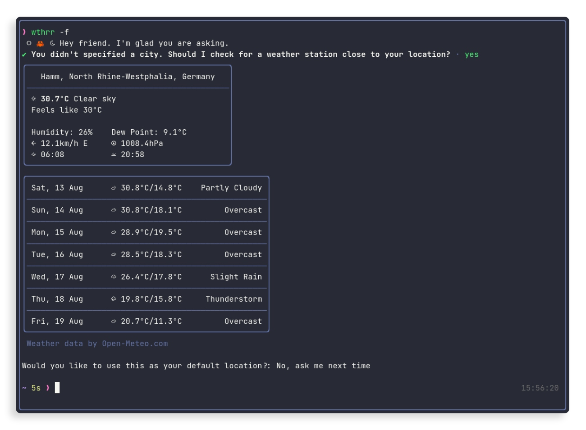

# 🦀 wthrr-the-weathercrab

When spending a lot of time in the CLI it can be handy to have a little companion in there who knows about the weather.

That's where `wthrr` comes in. She lives in your terminal and her passion is the weather.

Even when you don't spend a lot of time in the terminal. She has a sunny personality, so you can visit her once in a while.<br>
<sub>_Little tip: ask her about the weather._</sub>

## Contents

-  <a href="https://github.com/tobealive/wthrr-the-weathercrab#how-to-use">How to use?</a>
-  <a href="https://github.com/tobealive/wthrr-the-weathercrab#requirements">Requirements</a>
-  <a href="https://github.com/tobealive/wthrr-the-weathercrab#installation">Installation</a>
-  <a href="https://github.com/tobealive/wthrr-the-weathercrab#outlook">Outlook</a>

## How to use?

**Just call**

```
wthrr
```

When you don't specify an address. Wthrr will use the address that you have configured as default.<br>
If you don't have a configuration yet, wthrr can try to search for a weather station close to you and
save the last searched location as your default.

**You can always specify any address with your call.** E.g.,

```
wthrr melbourne
```

Depending on the location you search for, you need to be more specific.
For example, the call above will get you Melbourne in Australia. If you aim for Melbourne in the US, you could ask for `melbourne,florida`.
To ask about a city containing spaces, write it separated with a dash or wrapped in quotes (e.g., `new-york` or `'new york'`).

If you have a default address configured, but you want wthrr to explicitly search for a nearby weather station, you can do so by calling:

```
wthrr auto
```

### The help information gives you an overview of further usage parameters

```
> wthrr -h

USAGE:
    wthrr [ADDRESS] [OPTIONS]

ARGS:
    <ADDRESS>    Address to check the weather for

OPTIONS:
    -f, --forecast        Include the forecast for one week
    -h, --help            Print help information
    -r, --reset-config    Wipe wthrr's configuration data
    -s, --save-config     Save the supplied values as default
    -u, --unit <UNIT>     Unit of measurement ['c' (°Celsius) | 'f' (°Fahrenheit)] [default: c]
    -V, --version         Print version information
```

---

_First run example asking for the forecast of the week_


## Requirements

This app uses font icons and emojis. Therefore, a nerd variant of your font is required to correctly display the output.
https://github.com/ryanoasis/nerd-fonts

<sub>If you are using brew, this gist contains easy digestible copy-pasta for nerd-font installation.<br>
https://gist.github.com/davidteren/898f2dcccd42d9f8680ec69a3a5d350e</sub>

Some terminal emulators might require you to additionally add/prioritize emojis in their font config.

## Installation

Until binary releases are provided, rusts package manager is a simple way to install the binary crate.

```
cargo install wthrr
```

### Build from source

Alternatively, you can build the app from source yourself.
Assuming you have the rust toolchain installed.
Just clone the repo and build the release version.

```
git clone https://github.com/tobealive/wthrr-the-weathercrab.git
cd wthrr-the-weathercrab
cargo build --release
```

And you'll find the `wthrr` binary inside the `./target/release` directory

## Outlook

-  [ ] Language support
-  [ ] Allow to show more / customized meteorological data
-  [ ] Custom number of forecast days
-  [ ] Theme variants

Your contributions like 🪲bug reports, ⭐️stars and 💡suggestions are welcome alike.

## Credits

- The app uses the open-source weather API for non-commercial use provided by <a href="https://open-meteo.com/en">Open Meteo</a>.
